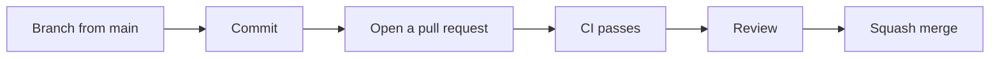

# Contributing to bingsu

Thanks for your interest in bingsu! 🍧
This guide explains how changes get into the repository and what the checks expect.

> bingsu is in the design stage. There is no Rust code yet, so the build and test steps below
> describe the setup that switches on once the first crate lands.

## Table of contents

- [Ways to contribute](#ways-to-contribute)
- [Workflow](#workflow)
- [Branch names](#branch-names)
- [Commit messages](#commit-messages)
- [Pull requests](#pull-requests)
- [CI checks](#ci-checks)
- [Development setup](#development-setup)
- [Design rules](#design-rules)
- [Changelog](#changelog)
- [License](#license)

## Ways to contribute

| You want to | Do this |
| -- | -- |
| Report a bug | [Open a bug report](https://github.com/ai-screams/Bingsu/issues/new?template=bug_report.yml) |
| Suggest a feature, flavor or segment | [Open a feature request](https://github.com/ai-screams/Bingsu/issues/new?template=feature_request.yml) |
| Report a security issue | Do **not** open an issue. Follow [SECURITY.md](SECURITY.md) |
| Fix a typo or improve docs | Open a pull request directly |
| Change behavior or add a feature | Open an issue first so the design can be agreed before you write code |

## Workflow

All changes reach `main` through pull requests. Nobody pushes to `main` directly.



1. Create a branch from the latest `main`.
2. Keep one topic per pull request. Do not mix a refactor, a feature and a docs rewrite.
3. Open a pull request and fill in the template.
4. When CI is green and the review is done, the pull request is **squash merged**.
   The pull request title becomes the commit on `main`, so it has to follow the commit format below.
5. The branch is deleted automatically after the merge.

## Branch names

`<type>/<summary>` in kebab-case, with an issue number when there is one:

```text
feat/12-git-status-segment
fix/zsh-right-prompt-width
docs/contributing-guide
```

`type` is one of the commit types below. Pick the type of the main change in the branch.

## Commit messages

bingsu uses [Conventional Commits](https://www.conventionalcommits.org/en/v1.0.0/).
Pull request titles use the same format because they become the squash commit.

```text
<type>(<scope>): <summary>
```

| Type | Use for | In the changelog |
| -- | -- | -- |
| `feat` | A new feature | Added |
| `fix` | A bug fix | Fixed |
| `perf` | A performance improvement | Performance |
| `refactor` | A code change that neither fixes a bug nor adds a feature | Changed |
| `docs` | Documentation only | Documentation |
| `test` | Tests only | Hidden |
| `build` | Build system or packaging | Build |
| `ci` | CI configuration | Hidden |
| `chore` | Maintenance; `chore(deps)` for dependency updates | Miscellaneous, Dependencies |
| `revert` | Reverting an earlier commit | Reverted |

Rules:

- Write the summary in English, in the imperative mood, without a trailing period, under 72 characters.
- `scope` names the area you changed, such as `prompt`, `color`, `git`, `zsh`, `config` or `ci`.
- Mark breaking changes with `!` after the type or scope (`feat(config)!: ...`) and explain them in the body.

## Pull requests

Before you open one:

- [ ] The title follows the commit format.
- [ ] The description says **what** changed, **why**, and **how you verified it**.
- [ ] Tests cover new behavior. For a new check or condition, you have seen the test fail without your change.
- [ ] No secrets, tokens or personal paths in the diff.
- [ ] User-visible changes are described so they can be picked up in the changelog.

## CI checks

| Check | What it does | Runs when |
| -- | -- | -- |
| Lint workflows (actionlint) | Checks GitHub Actions workflows, including their shell scripts | Always |
| Secret scan (gitleaks) | Scans the full git history for leaked secrets | Every push and pull request, and weekly |
| Lint (rustfmt, clippy) | `cargo fmt --check` and `cargo clippy -D warnings` | Once `Cargo.toml` exists |
| Test | `cargo test` on Linux, macOS and Windows | Once `Cargo.toml` exists |
| Dependency advisories (cargo-audit) | Checks `Cargo.lock` against the RustSec database | Once `Cargo.lock` exists |

All actions are pinned to a commit SHA, and downloaded tools are verified against their published checksums.
Dependabot proposes updates weekly.

## Development setup

### Prerequisites

| Tool | Why |
| -- | -- |
| Rust (stable) via [rustup](https://rustup.rs) | Builds the engine |
| bash, zsh and fish | Manual testing of shell integration |
| A [Nerd Font](https://www.nerdfonts.com) | Seeing the default icon set as intended |

### Commands

```bash
cargo build
cargo test --workspace --all-features
cargo fmt --all --check
cargo clippy --workspace --all-targets --all-features -- -D warnings
```

Run the same checks as CI before you push.

## Design rules

bingsu cares about things lining up. Keep these in mind when you touch anything visible:

1. **Colors come from tokens.** Do not hard-code a color in a segment or a generator. Add or reuse a role token.
2. **Contrast is checked.** Text needs at least 4.5:1 against its background and non-text marks at least 3:1.
3. **Color is never the only signal.** Pair it with a symbol or text, so the prompt still reads without color.
4. **Width is counted in terminal cells.** Separators take exactly one cell. Right-aligned content must end on the last cell.
5. **Every icon has a fallback.** Nerd Font glyphs need Unicode and ASCII alternatives.
6. **The prompt must not wait.** Slow work gets a time budget and runs in the background.

## Changelog

[CHANGELOG.md](CHANGELOG.md) follows [Keep a Changelog](https://keepachangelog.com/en/1.1.0/) and is generated from commit
messages with [git-cliff](https://git-cliff.org) using [`cliff.toml`](cliff.toml). Good commit messages make a good changelog.

```bash
git cliff --unreleased --prepend CHANGELOG.md   # add unreleased changes
git cliff --tag v0.1.0 -o CHANGELOG.md          # regenerate for a release
```

## License

By contributing, you agree that your contributions are dual licensed under the
[MIT](LICENSE-MIT) and [Apache-2.0](LICENSE-APACHE) licenses, as described in the [README](README.md#license).

Please also follow the [Code of Conduct](CODE_OF_CONDUCT.md).
